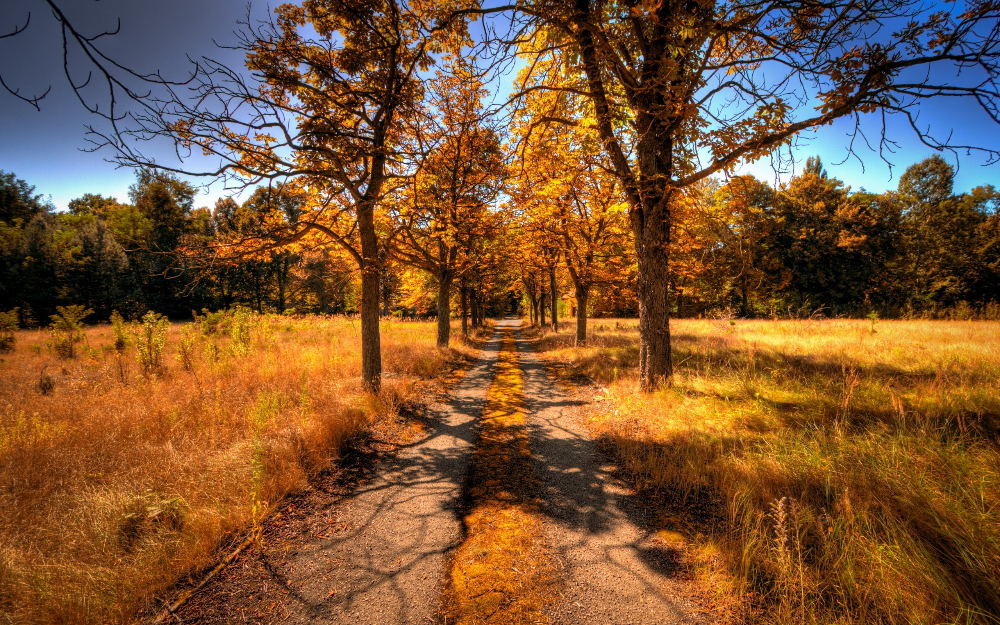

# Guihan-Li_guli3430_IDEA9103_TUT6

## **Instructions on how to interact with the work**
1. **Loading page**
Open my code and navigate to the page containing the code via Live Sever. Please wait for the page to fully load, at which point you will see my work.

2. **Using Keyboard Interaction**
- Pressing the Up Arrow key moves the center of the “tree” up.
- Pressing the Down Arrow key moves the center of the “tree” down.
- Pressing the Left Arrow key moves the center of the “tree” to the left.
- Pressing the Right Arrow key moves the center of the “tree” to the right.
- After releasing any arrow key, the center of the “tree” will stop moving.

3. **Using Mouse Interaction**
Mouse Click: Click anywhere on the canvas to generate fireworks. Each click will create a set of random color fireworks at the clicked position, which will fall in the direction of gravity, simulating the real fireworks explosion effect.

## **Details of my individual approach to animating the group code**
1. The elements of interaction and time are used. With mouse clicks, the user can generate fireworks effects on the canvas, with each click creating a new fireworks object. Using the keyboard, the user can control the “tree” position by pressing or releasing the arrow keys to change the visual effect. In addition, the code also uses countdown and gravity to simulate the fireworks effect. Each fireworks object has a countdown attribute, which will explode at the end of the countdown, generating more particles, which are gradually falling under the influence of gravity, creating a dynamic visual effect.

2. In my work, the following main image properties are animated:

**Fireworks effect**: A fireworks effect is generated when the user clicks on the canvas. These fireworks particles will explode on the canvas, forming randomly colored particles that will gradually fall.

**Center Position**: The user can control the " tree " position by pressing and releasing the arrow keys.

**Color change**: The color of the firework particles is random, and the color of the particles generated by each explosion will be different, which increases the diversity and interest of the visual effect.

3. My inspiration is as follows:

   The piece we chose to restore was 'Apple Tree'. I was initially inspired by the theme of celebrating the fall harvest, so I collected many images of fall, including golden leaves, harvest fruits and other elements. In my country, fireworks are often set off for major celebrations, such as the Chinese New Year. For farmers, the harvest is the most joyful time, so I decided to use fireworks as the primary visual element to show the joy of the harvest and the atmosphere of celebration.

4. The parts of my code that primarily animate the image include the fireworks effect and the movement of the center of the canvas. I made larger changes to increase interactivity and dynamic effects than the initial group code. By making these improvements, my code added richer dynamic effects and user interactivity, making the work visually more vivid and distinctly different from the work of other group members. While other group members' work may focus on color changes or component resizing of static images, my work enhances the overall interactive experience and visual impact through fireworks effects and dynamic changes in canvas position.

- **Major Changes and Animated Properties**
   - Differentiating from our group’s work, I added a fireworks effect that generates fireworks when the user clicks on the canvas. Each firework object will explode in the air, generating multiple particles that will change color randomly and gradually fall under gravity, simulating the natural firework effect.

   - In our work, the position of the image on the canvas is fixed, and there is no movement effect. In my work, I added the ability to control the “tree” in the canvas using the arrow keys. When the user presses the arrow keys, the “tree” will move in the corresponding direction, making the image more dynamic and interactive.

- **The specific implementation of animation**
   - In the mousePressed function, each click creates a new Firework. The fireworks object explodes at the end of the countdown, generating more particles, which disappear according to gravity and speed.

   - In the keyPressed and keyReleased functions, the position of the center of the “tree” is moved by updating the values of moveX and moveY by pressing and releasing the arrow keys.

- I was inspired by [Fireworks in Happy Coding](https://happycoding.io/tutorials/p5js/creating-classes/fireworks). This work shows how to create fireworks effects using p5.js and manages particle generation and animation by creating classes.

    - **Technical explanation**
        - **Creating Classes**:
           Each particle has properties such as position, velocity, color and size, and a step method for updating the position and state of the particle. 

         - **Fireworks explosion effect**:
            The fireworks class contains a countdown timer, and the fireworks explode when the countdown is over, generating more particles.

        - **Animation update and drawing**:
            The step method of the particle is called every frame to update its position, and the draw method is called to draw the particle.

        - **Reasons for use**
            I chose this technique because it provides a structured way to manage particle generation and animation effects. In addition, this method also makes the fireworks effect vivid, in line with the theme of celebrating the harvest in my work.